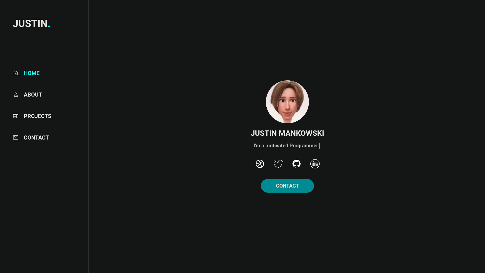

<h1 align="center">Portfolio</h1>



_________________

## Usage

Run portfolio inside a docker container

```bash
# run production build
$ docker-compose up -d

# run production build (with rebuild in case of new changes)
$ docker-compose up -d --build

# view docker logs
$ docker-compose logs -t -f

# close docker process
$ docker-compose down
```

## Development

```bash
# switch to working directory
$ cd frontend/

# install necessary dependencies
$ npm install

# run application in dev mode port :3000
$ npm run dev
```

## Licensing

Distributed under the MIT License. See [LICENSE](LICENSE.md) for more information.